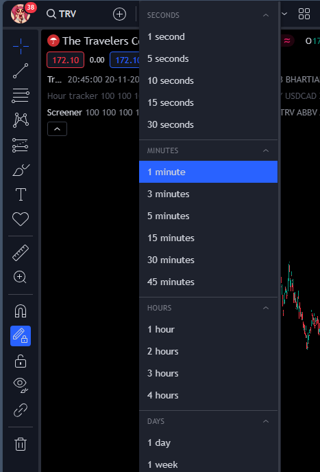

# How to start TTE

1. Follow the instructions for:
   - [Pinescript](#for-pinescript)
   - [main.py](#for-mainpy)
   - [database/local_db.py](#for-databaselocal_dbpy)
   - [resources/symbol_settings.py](#for-resourcessymbol_settingspy)
   - [send_to_socials/send_to_discord.py](#for-send_to_socialssend_to_discordpy)
   - [open_tv.py](#for-open_tvpy)
2. To run TTE:
   - Option 1: Run the main.py file or start the exe file in the dist directory
   - Option 2: To run without the GUI:
     - Open a terminal and navigate to the project directory
     - Run `pipenv shell` to activate the virtual environment
     - Run `python main.py` to start the application

# Things to keep in mind while TTE is running

## Browser

1. Do not move/click anything on the selenium controlled browser
2. Make sure you are fine with it deleting any alerts and creating new ones
3. Make sure that any other chrome browser is closed otherwise it won't work
4. Make sure that when the selenium controlled browser is opened, no other tab is manually opened

## Tradingview

1. No popups or clicks should happen manually
2. In the alert settings, "On site Pop up" is unticked
3. the "Alerts log" must be maximized (although it doesn't have to be FULLY maximized) and not minimized.
4. There must be a saved layout named "Screener" which has the following setup:
   - The bars are medium sized and the chart is a 100 bars from the right
   - Premium Screener indicator & Trade Drawer indicator should be on the chart
5. There must be a saved layout named "Exits" and the Get Exits indicator should be on it.
6. The Premium Screener and the Get Exits indicators on Tradingview must to be starred (so that they can appear in the Favorites dropdown)

## Some errors which might happen on Tradingview

1. "Modify_study_limit_exceeding" error can happen on a script whose inputs are getting changed frequently.
2. "Calculation timed out" error happens when the script exceeds the time limit for calculation
3. "Stopped - Calculation error" can happen in the alert

# Configuration

### For .env

1. Ensure that all the Discord webhook links and webhook names are set in the .env file. 
2. Ensure that the X API keys, tokens and secrets are set in the .env file.

### For env.py

1. Ensure that the `PROFILE` constant is set to the profile (in the chrome user data directory) which you want TTE to use as the chrome profile. Please ensure that it uses the profile for the dassamaara account. This is the chrome user data directory: `'C:\\Users\\Username\\AppData\\Local\\Google\\Chrome\\User Data'`

### For open_tv.py

1. Ensure that you have the `CHROME_PROFILES_PATH` User Environment Variable. The value of this variable should be the path to the chrome user data folder. Eg: `CHROME_PROFILES_PATH = 'C:\\Users\\Username\\AppData\\Local\\Google\\Chrome\\User Data'`

2. Ensure that you have a TTE folder in the chrome user data directory: `'C:\\Users\\Username\\AppData\\Local\\Google\\Chrome\\User Data'`. If there's an existing TTE folder, delete it and create a new one.

4. Ensure that you have the `TRADINGVIEW_EMAIL` and `TRADINGVIEW_PASSWORD` user environment variables. This application signs in to TradingView using them. Please ensure that you have followed the instructions below as well.

5. When changing the `TRADINGVIEW_EMAIL` and `TRADINGVIEW_PASSWORD` user environment variables, ensure that:
   - Two-factor authentication is disabled for the corresponding TradingView account (check under Settings -> Privacy and Security)
   - No social accounts are linked to the TradingView account. Check under Settings -> Privacy and Security. (if you don't see "Linked social accounts", you're good)
   - You originally created the account using email/password, not through Google or other social sign-ins

These steps are crucial as they allow TTE to securely sign in to TradingView using the email and password you provide.

6. `SYMBOL_INPUTS` in `open_tv.py` should be the number of inputs in the screener which will be filled with symbols by Python. There are currently a total of 20 symbol inputs in the screener. Only a couple of them will get filled (currently, only 5). So, don't give this constant a value of the total number of symbol inputs. To change how many symbols can get filled, go to the screener's code in Pine Script.

7. In `open_tv.py`, specify the timeframe of the chart. It is in the `CHART_TIMEFRAME` constant. This is the timeframe which the entries run on. The value of the constant should be a string and one of these options (The spelling must be correct):

8. In `open_tv.py`, make sure the `USED_SYMBOLS_INPUT` constant is the name of the "Used Symbols" input in the screener

9. In `open_tv.py`, make sure the `LAYOUT_NAME` constant is set to the name of the layout on Tradingview which is meant for the screener.

10. In `open_tv.py`, the constant `SCREENER_REUPLOAD_TIMEOUT` has to have a value for the seconds it should wait for the screener to be re-uploaded on the chart (if it needs to be re-uploaded).

### For send_to_socials/send_to_discord.py

1. `BI_REPORT_LINK` should be the shortened link of the latest Trade Stats Power BI Report. Use Bitly to shorten it.

### For resources/symbol_settings.py

In Poolsifi's discord server, there are 4 categories: CURRENCIES, US STOCKS, INDIAN STOCKS and CRYPTO.
In each category, there are 3 channels: strategy-1, exits and before-and-after.
The instructions below will show you what you need to do for each category and its channels.
Note: The indices category is not used anywhere because papa told me to remove it as barely a few entries and exits are made.

**For the CURRENCIES category:**

- `CURRENCIES_WEBHOOK_NAME` in categories.py should be "Currencies".
- `CURRENCIES_ENTRY_WEBHOOK_LINK` in categories.py should be the webhook link of the strategy-1 channel.
- `CURRENCIES_EXIT_WEBHOOK_LINK` in categories.py should be the webhook link of the exits channel.
- `CURRENCIES_BEFORE_AFTER_WEBHOOK_LINK` in categories.py should be the webhook link of the before-and-after channel.

**For the US STOCKS category:**

- `US_STOCKS_WEBHOOK_NAME` in categories.py should be "US Stocks".
- `US_STOCKS_ENTRY_WEBHOOK_LINK` in categories.py should be the webhook link of the strategy-1 channel.
- `US_STOCKS_EXIT_WEBHOOK_LINK` in categories.py should be the webhook link of the exits channel.
- `US_STOCKS_BEFORE_AFTER_WEBHOOK_LINK` in categories.py should be the webhook link of the before-and-after channel.

**For the INDIAN STOCKS category:**

- `INDIAN_STOCKS_WEBHOOK_NAME` in categories.py should be "Indian Stocks".
- `INDIAN_STOCKS_ENTRY_WEBHOOK_LINK` in categories.py should be the webhook link of the strategy-1 channel.
- `INDIAN_STOCKS_EXIT_WEBHOOK_LINK` in categories.py should be the webhook link of the exits channel.
- `INDIAN_STOCKS_BEFORE_AFTER_WEBHOOK_LINK` in categories.py should be the webhook link of the before-and-after channel.

**For the CRYPTO category:**

- `CRYPTO_WEBHOOK_NAME` in categories.py should be "Crypto".
- `CRYPTO_ENTRY_WEBHOOK_LINK` in categories.py should be the webhook link of the strategy-1 channel.
- `CRYPTO_EXIT_WEBHOOK_LINK` in categories.py should be the webhook link of the exits channel.
- `CRYPTO_BEFORE_AFTER_WEBHOOK_LINK` in categories.py should be the webhook link of the before-and-after channel.

### For database/local_db.py

1. Ensure that the `MONGODB_PWD` user environment variable is set to the password of the mongodb database. To edit that password, sign in to MongoDb and go to Database Access on the left. Click on the user (i.e. sammy) and edit the password.

2. When the symbols in the database are added/updated/removed, ensure that TTE creates new alerts so that the updated symbols can be used. This is necessary so that Stock Buddy can get signals for the symbols that TTE is actually using. 

### For exits.py

1. `COLLECTION_NAME` is supposed to be the name of the MongoDB collection where all entries are stored.
2. The keys in the `self.last_checked_dates` dictionary in the `__init__` function should be the values of the category field in MongoDB documents (i.e. Currencies, US Stocks, Crypto etc...)

### For main.py

1. `SCREENER_SHORT` is supposed to be the shorttitle of the screener.
2. `DRAWER_SHORT` is supposed to be the shorttitle of the Trade Drawer indicator.
3. `SCREENER_NAME` is supposed to be the name of the screener (the name of the script).
4. `DRAWER_NAME` is supposed to be the name of the Trade Drawer indicator (the name of the script).
5. `INTERVAL_MINUTES` has to be set to the number of minutes Python should wait until it restarts all the inactive alerts
6. `START_FRESH` is like an on/off switch for starting fresh, deleting all alerts and setting up new alerts OR just opening TradingView, keeping the pre-existing alerts and waiting for alerts to come. If it's `True`, the application will open TradingView, delete all the alerts and start setting up all 260 alerts again. If it's `False`, the application will open TradingView, NOT delete the alerts but instead keep all the alerts that were made when the application was previously run. This variable was created so that I could do 2 things:
   - When I leave the application running, come back in the morning to find it frozen and find alerts in the Alerts log that are unread by the application, I would like to re-start the application and keep the alerts that were made when it ran previously without deleting all the alerts and therefore, keeping the alerts in the Alerts log. So, when I run the application with `START_FRESH` set to `False`, the application will keep all the alerts, read the unread alerts that came when it was previously running and wait for new alerts.
   - When I think I need to start fresh, delete all the alerts and make new ones, I can set `START_FRESH` set to `True`.
7. **Screener Timeframe Configuration:**
   - `SCREENER_TIMEFRAME_1`, `SCREENER_TIMEFRAME_2`, and `SCREENER_TIMEFRAME_3` define the 3 timeframes that will be automatically set for each screener
   - These constants must match one of the values in the `TIMEFRAME_ID_MAP` dictionary
   - The `TIMEFRAME_ID_MAP` dictionary maps timeframe names to their corresponding TradingView dropdown element IDs
   - **Important**: Ensure that the 3 timeframe constants have corresponding ID attributes in the ID dictionary. To get these "id attributes":
     1. Go to TradingView and open one of the screeners in the PointCapital layout
     2. Click on any timeframe input (e.g., 4H) to open the dropdown menu
     3. Open Developer Tools (F12)
     4. Select an option in the opened dropdown menu
     5. Each option is a div with an id attribute (e.g., `id="item_240"` for 4 hours)
     6. Find the corresponding id attribute for each of the 3 timeframe constants and ensure it exists in the `TIMEFRAME_ID_MAP` dictionary
   - This is crucial as TTE needs these IDs to automatically select the correct timeframes for each screener

### For Pinescript
- Download these indicators and set them up on Tradingview:
   - [Order Block Screener](https://drive.google.com/file/d/1ORTa2TUwb4m4TCKNTmrjBc4sACffvi2t/view?usp=drive_link)
   - [Nadaraya Watson Screener](https://drive.google.com/file/d/1crtBVlGivH6j8exWPkwpsHXk9RI1C4DE/view?usp=drive_link)
   - [Structure Break Screener](https://drive.google.com/file/d/1crtBVlGivH6j8exWPkwpsHXk9RI1C4DE/view?usp=drive_link)

- The screeners should have 15-20 inputs (So that Python can click on it)

- If the symbols in `symbol_settings.py` are rare and have prices like -5.0000000034782 or 0.00000389, go to the screener and fix the code in the alertMsg function to make it convert those prices into their correct string versions. Their string versions should be the exact same as the prices and should not be rounded off and the decimal places should not be cut off.

- The timeframetoString function in the 3 tradingview screeners must handle the 3 timeframes which are in the inputs of each screener

- Ensure that the values of `SCREENER_TIMEFRAME_1`, `SCREENER_TIMEFRAME_2` and `SCREENER_TIMEFRAME_3` are mentioned in the `TIMEFRAME_INPUT_MAP` dictionary as keys. Their values should be the timeframe in  Pine Script.

- Ensure that the values of the Nadaraya Watson inputs in the Nadaraya Watson screener match the inputs in the The Trade Drawer 2 indicator. Trade Drawer 2 will draw the correct Nadaraya Watson line that the screener uses for its signals. That's why the Nadaraya Watson inputs have to be the same