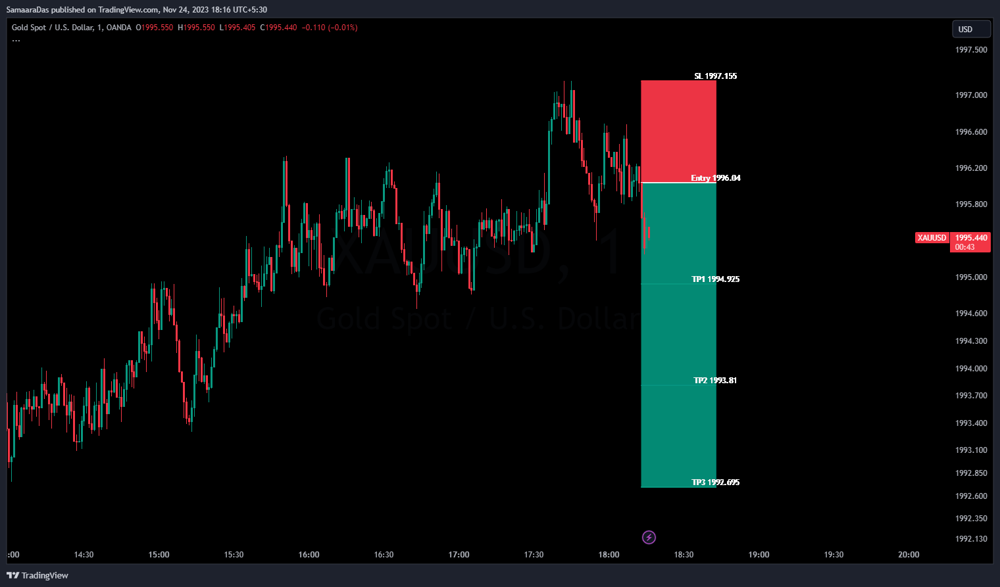
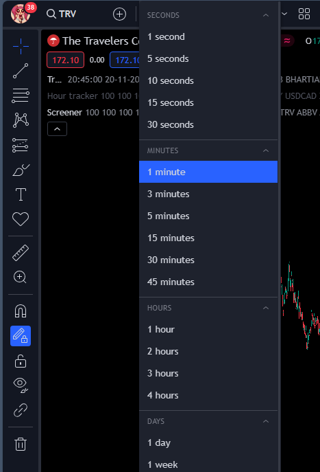
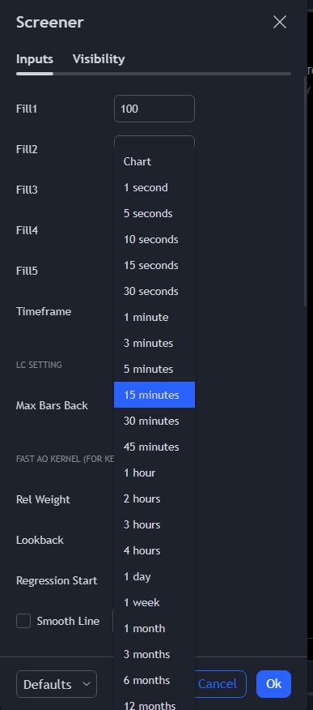
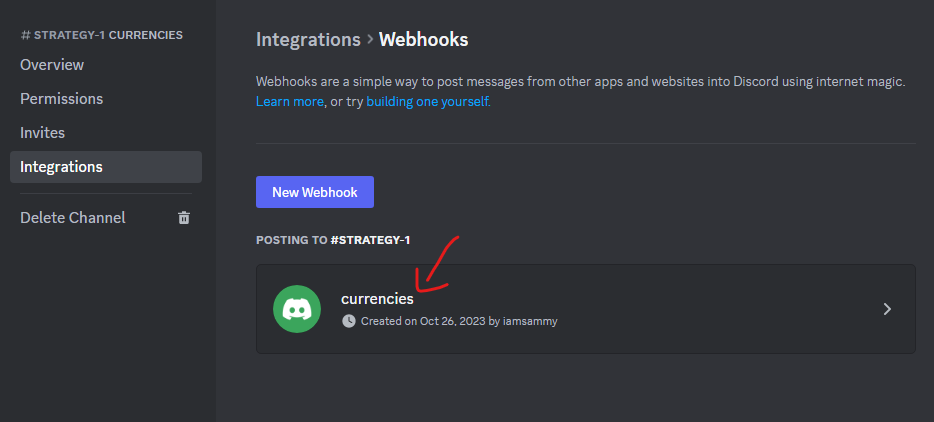
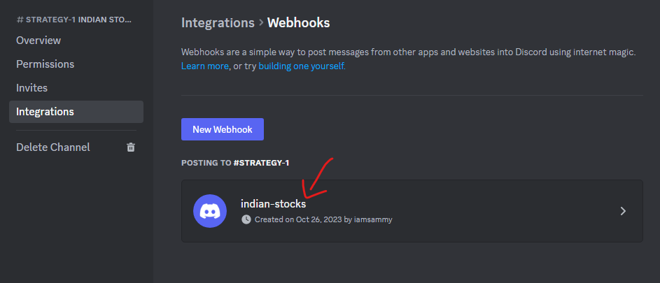

# Tradingview to Everywhere

## Note
These are some of the changes that can be incorporated from the multi-alert branch into this branch. There are more changes that can be added as well but I haven’t been keeping track of them. 

- if `__name__ == '__main__':` in main.py
- under categories.py, add new description
- adding success statements and error statements in functions
- change logic in open_tv.py alerts_sidebar_open()
- change logic in open_tv.py change_settings()
- add ‘4. the "Alerts log" must be maximized and not minimized. ‘ in README
- in change_tframe, add one more return False statement
- in no_alerts and delete_all_alerts, change the selector of the alerts to this: 'div.list-G90Hl2iS div.itemBody-ucBqatk5'
- test the single alert system again

## Branch description
This branch is for using a single alert and the screener to give only entry signals. This system will not be used for Poolsifi. The development of this branch is complete.

## What this does 
This opens Tradingview, sets it up and sets an alert for the Hour tracker indicator. The indicator gives an alert everytime a new bar is formed. Since the timeframe will be 1 hour, a new bar will form every hour. So, an alert will also come every hour.

Once an alert comes, the alert for the Hour tracker is deleted and the process of checking for entries begins.

Python has a set of categories (Us Stocks, Crypto, Indices) and their own symbols (Us Stocks - AAPL & TESLA, Crypto - BTCUSD & ETHUSDT etc.).
Now, it will put each of those category's symbols into the screener. Since the screener only accepts 15 at the most and all of the symbols won't load all at once into the screener, the symbols will be loaded into the screener set by set. 

After the symbols of a category are loaded, an alert is set for the screener. The alerts give us info about any entries which might've come in the symbols of the screener. If there are no entries, a blank alert will come.

After an alert comes, Python reads it and gets the info of all the enries (if there were any). It then goes to each entry's symbol and puts its TP, SL & entry time inside the Trade Drawer indicator. That indicator, which now has the SL, TP & entry time of the entry, draws the entry on the chart. It looks like this:

---

Then, Python takes a snapshot of the entry and sends it to Poolsifi, Discord and a local database. It does all this for each entry which the alert gave.

After this process finishes, the alert for the screener gets deleted. Python goes to the next category and loads its symbols into the screener and sets an alert for that. Then it waits for entries to come in the alert and takes snapshots of the entries and sends them to Poolsifi, Discord and a local database.

This gets repeated for all the categories and their symbols. 

After Python has been through all the categories and their symbols, the process starts from the beginning. An alert for the Hour tracker is made and Python waits for an alert to come. Once it comes, the process of checking for entries begins.

## Things to do for programmers:

### For open_tv.py
1. In `open_tv.py`, the constant `SCREENER_REUPLOAD_TIMEOUT` has to have a value for the number of seconds it should wait for the screener to be re-uploaded on the chart. The default is 15 seconds.

2. In `open_tv.py`, make sure the `LAYOUT_NAME` constant is set to the name of the layout which is meant for the screener.

3. In `open_tv.py`, make sure the `SCREENER_MSG_TIMEOUT` constant is set to the number of seconds that Python will wait for the screener's alert to come up in the Alerts log. the default is 77 (1min 17secs)

4. In `open_tv.py`, make sure the `USED_SYMBOLS_INPUT` constant is equal to the name of the Used Symbols input in the screener

5. In `open_tv.py`, change the `SYMBOL_DELAY` constant to the number of seconds to wait for a new symbol to load on the chart

6. In `open_tv.py`, change the `DEFAULT_SYMBOL` constant to a symbol that the hour tracker alert will be set up on. The default value is BTCUSD because crypto symbols are always open. Since they're always open, new price ticks will form and new bars will form and that will cause the alert to run. The default symbol should run 24/7.

7. In `open_tv.py`, specify the timeframe of the chart and of the screener. The timeframe of the chart is the timeframe which the indicators run on. It is in the `CHART_TIMEFRAME` constant. The value of the constant should be a string and one of these options (The spelling must be correct): 
The timeframe of the screener is the Timeframe input in the screener which controls the timeframe of the entries. It is in the `SCREENER_TIMEFRAME` constant. It should be a string and one of these options (The spelling must be correct): 

8. `SYMBOL_INPUTS` in `open_tv.py` should be the same as the number of symbol inputs in the screener

### For categories.py
1. In `categories.py`, make the values of the constants equal to the names of the discord webhooks where the snapshots are supposed to go. Examples: The `CURRENCIES` constant has the value of "currencies" because that is the name of the webhook for the channel underneath the "CURRENCIES" discord group. This is the webhook for the channel:   
The `INDIAN_STOCKS` constant has the value of "indian-stocks" because that is the name of the webhook for the channel underneath the "INDIAN STOCKS" discord group. This is the webhook for the channel: 

2. In `categories.py`, also put the webhook link for each discord channel. Each constant that ends with `_WEBHOOK_LINK` should have a link which is associated with that specific constant (that specific channel).

### For main.py
1. In `main.py`, specify the indicators' short-titles. They are currently: "Trade" and "Screener". 

2. In `main.py`, specify the screener indicator's & trade drawer indicator's script names. They are currently "Premium Screener" & "Trade Drawer"

### For Pinescript
1. Premium Screener can have only 1 input which is opens a dropdown. That is the Timeframe input. It has to be this way so that the Timeframe input can be found in `change_screener_timeframe` in `open_tv.py`

2. In the Trade Drawer indicator, in Pinescript, the first 6 inputs have to be arranged in this order: dateTime, entry, sl, tp1, tp2, tp3

3. If the symbols in `symbol_settings.py` are rare and have prices like -5.0000000034782 or 0.00000389, go to the screener and fix the code in the alertMsg function to make it convert those prices into their correct string versions. Their string versions should be the exact same as the prices and should not be rounded off and the decimal places should not be cut off.

4. The Premium Screener indicator on Tradingview has to be starred (so that it can appear in the Favorites dropdown)

### For symbol_settings.py
1. In `symbol_settings.py`, in `main_symbols`, each category should have symbols that are of the same timezone (trading session) so that if 1 symbol is closed, that would mean that the other symbols of the category are closed. That would also mean that if 1 symbol is open, the other symbols of the category are open. 1 symbol should speak for the rest. This is done to prevent looking for signals on a closed market. If the symbols in a category are of the same timezone, that would mean that one of the symbols would speak for the rest of the symbols' timezone. 

## Some errors which might happen
1. "Modify_study_limit_exceeding" error can happen on a script whose inputs are getting changed frequently. 
2. "Calculation timed out" error happens when the script exceeds the time limit for calculation
3. "Stopped - Calculation error" can happen in the alert

## Browser
1. Do not move/click anything on the selenium controlled browser
2. Make sure you are fine with it deleting any alerts and creating new ones
3. Make sure that any other chrome browser is closed otherwise it won't work
4. Make sure that when the selenium controlled browser is opened, no other tab is manually opened

## Tradingview
1. Please use the dassamaara gmail id to login to Tradingview as the chart on that account has been set up in a specific way
2. No popups or clicks should happen manually
3. In the alert settings, "On site Pop up" is unticked
4. There must be a saved layout named "Screener" which has the following setup:
    - The background has the symbol & timeframe watermark
    - The bars are medium sized and the chart is a 100 bars from the right 
    - Premium Screener indicator, Hour tracker indicator and Trade Drawer indicator should be on the chart
    - Premium Screener should have 15 inputs for the symbols
    
