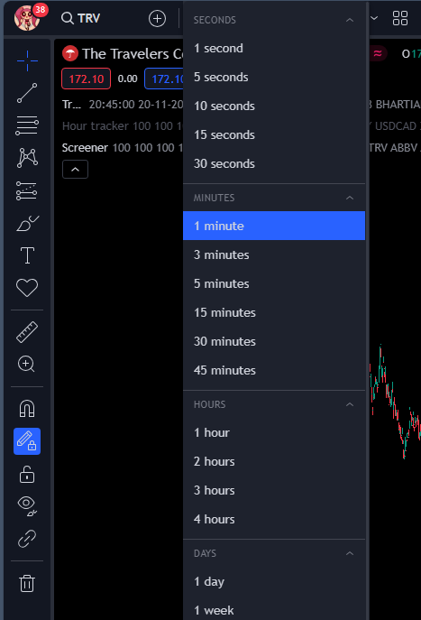
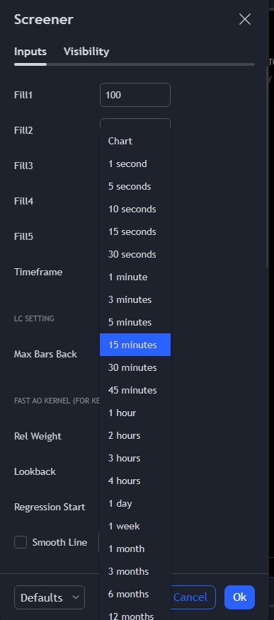

# What is this branch for?
I'm currently working on this branch. This branch is for making this architechture: Load symbols into the screener. Set up an alert for it. wait for an alert to come. If the alert has entries, take snapshots of them and post to discord and poolsifi. Repeat this 15 times. Do this every hour (because that’s when a new hourly bar comes)

# Tradingview to Everywhere

## What this does
Opens tradingview, opens a couple tabs and sets alerts on each of them. These alerts will be for the screener and will notify us about a new entry/exit which happened in the screener. 

Entries happen on the 1hr timeframe. This timeframe is set in Pinescript.

Then, after the alerts are set, all the tabs are closed and 1 remains open. It will be reading the alerts which come on that tab. When the alerts come, it reads the entry/exit and other info like the Symbol, Timeframe, TP, SL etc...

It goes to that particular entry's/exit's symbol and timeframe and takes a snapshot of it.

Then it sends that snapshot to a database and to Poolsifi. 

## Things to do for programmers:
- In `main.py`, specify the indicators' short-titles. They are currently: "Trade" and "Screener". 
- In `main.py`, specify the screener indicator's & trade drawer indicator's script names. They are currently "Premium Screener" & "Trade Drawer"
- Premium Screener can have only 1 input which is opens a dropdown. That is the Timeframe input. It has to be this way so that the Timeframe input can be found in `change_screener_timeframe` in `open_tv.py`
- In `symbol_settings.py`, in `main_symbols`, each list should have atleast 15 symbols and each category should have symbols that are of the same timezone (trading session) so that if 1 symbol is closed, that would mean that the other symbols of the category are closed. That would also mean that if 1 symbol is open, that would mean that the other symbols of the category are open. 1 symbol should speak for the rest. This is done to prevent looking for signals on a closed market. If the symbols in a category are of the same timezone, that would mean that one of the symbols would speak for the rest of the symbols' timezone. 
- In `open_tv.py`, make sure the `LAYOUT_NAME` constant is set to the name of the layout which is meant for the screener.
- In `open_tv.py`, make sure the `SCREENER_MSG_TIMEOUT` constant is set to the number of seconds that Python will wait for the screener's alert to come up in the Alerts log. the default is 75 (1min 15secs)
- In `open_tv.py`, make sure the `USED_SYMBOLS_INPUT` constant is equal to the name of the Used Symbols input in the screener
- In `open_tv.py`, specify the timeframe of the chart and of the screener. 

The timeframe of the chart is the timeframe which the indicators run on. It is in the `CHART_TIMEFRAME` constant. The value of the constant should be a string and one of these options (The spelling must be correct): 

The timeframe of the screener is the Timeframe input in the screener which controls the timeframe of the entries. It is in the `SCREENER_TIMEFRAME` constant. It should be a string and one of these options (The spelling must be correct): 

- `SYMBOL_INPUTS` in `open_tv.py` should be the same as the number of symbol inputs in the screener
- The Premium Screener indicator on Tradingview has to be starred (so that it can appear in the Favorites dropdown)

## Some errors which might happen
- "Modify_study_limit_exceeding" error can happen on a pinescript script whose inputs are getting changed frequently. 
- "Calculation timed out" error happens when the script was calculating for a long time.
- "Stopped - Calculation error" can happen in the alert

### Browser & Tradingview
- Do not move/click anything on the selenium controlled browser
- Make sure you are fine with it deleting any alerts and creating new ones
- Make sure that any other chrome browser is closed otherwise it won't work
- Make sure that when the selenium controlled browser is opened, no other tab is manually opened

### Tradingview
- Please use the dassamaara gmail id to login to Tradingview as the chart on that account has been set up in a specific way
- No popups or clicks should happen manually
- In the alert settings, "On site Pop up" is unticked

- There must be a saved layout named "Screener" which has the following setup:
    - The background has the symbol & timeframe watermark
    - The bars are medium sized and the chart is a 100 bars from the right 
    - Premium Screener indicator, Hour tracker indicator and Trade Drawer indicator should be on the chart
    - Premium Screener should have 15 inputs for the symbols
    
