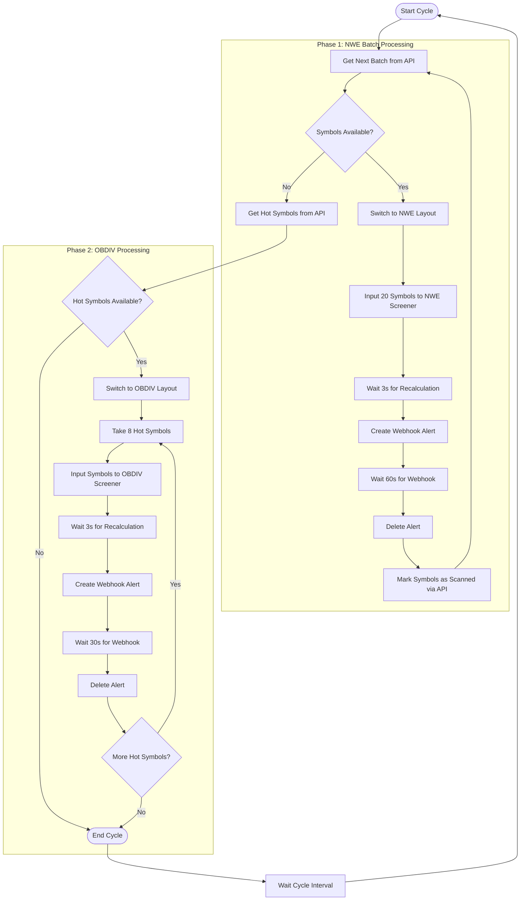
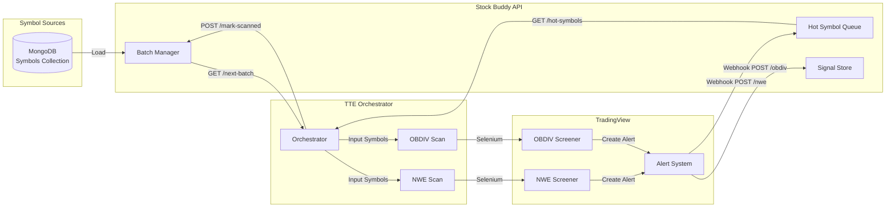

# TTE Tiered Architecture - Product Requirements Document

**Version**: 1.0
**Last Updated**: 2026-02-03
**Status**: Implementation Ready
**Branch**: `tiered-orchestrator`

---

## Table of Contents

- [Part 1: Overview & Context](#part-1-overview--context)
  - [1. Executive Summary](#1-executive-summary)
  - [2. Problem Statement](#2-problem-statement)
  - [3. Goals & Non-Goals](#3-goals--non-goals)
- [Part 2: Architecture](#part-2-architecture)
  - [4. System Architecture Overview](#4-system-architecture-overview)
  - [5. Two-Tier Workflow Design](#5-two-tier-workflow-design)
  - [6. Component Breakdown](#6-component-breakdown)
- [Part 3: Technical Specifications](#part-3-technical-specifications)
  - [7. Stock Buddy API Integration](#7-stock-buddy-api-integration)
  - [8. Selenium Automation Patterns](#8-selenium-automation-patterns)
  - [9. TradingView Indicator Integration](#9-tradingview-indicator-integration)
- [Part 4: Data & State](#part-4-data--state)
  - [10. Data Flow Pipeline](#10-data-flow-pipeline)
  - [11. State Management](#11-state-management)
  - [12. Webhook Payload Schemas](#12-webhook-payload-schemas)
- [Part 5: Configuration & Operations](#part-5-configuration--operations)
  - [13. Environment Configuration](#13-environment-configuration)
  - [14. TradingView Setup](#14-tradingview-setup)
  - [15. CLI Commands](#15-cli-commands)
- [Part 6: Implementation Guide](#part-6-implementation-guide)
  - [16. Implementation Phases](#16-implementation-phases)
  - [17. Code Reuse Guide](#17-code-reuse-guide)
  - [18. Testing Strategy](#18-testing-strategy)
- [Part 7: Appendices](#part-7-appendices)
  - [Appendix A: Complete Selector Reference](#appendix-a-complete-selector-reference)
  - [Appendix B: Existing Code to Reuse](#appendix-b-existing-code-to-reuse)
  - [Appendix C: Alert Message Formats](#appendix-c-alert-message-formats)
  - [Appendix D: Troubleshooting Guide](#appendix-d-troubleshooting-guide)

---

# Part 1: Overview & Context

## 1. Executive Summary

### Purpose

The TTE Tiered Architecture transforms the existing TradingView to Everywhere (TTE) system from a poll-based, single-tier alert scraping system into a webhook-driven, two-tier scanning platform that integrates with the Stock Buddy API.

### Scope

This PRD covers the complete implementation of:
- **Tier 1 (NWE)**: High-throughput symbol rotation scanning (20 symbols/batch)
- **Tier 2 (OBDIV)**: Focused analysis of "hot" symbols (8 symbols/batch)
- **Stock Buddy API**: Symbol management, rotation tracking, hot symbol queue
- **Webhook Integration**: Real-time data delivery from TradingView to backend

### Key Benefits

| Benefit | Legacy System | Tiered Architecture |
|---------|---------------|---------------------|
| **Throughput** | 5 symbols/batch | 20 NWE + 8 OBDIV per cycle |
| **Data Delivery** | Poll-based (latency) | Webhook (real-time) |
| **Symbol Coverage** | ~1300 symbols, slow rotation | Full rotation tracking via API |
| **Architecture** | Monolithic | Decoupled services |
| **State Management** | Local | Centralized (Stock Buddy API) |

---

## 2. Problem Statement

### Current System Limitations

1. **Low Throughput**: The legacy system processes only 5 symbols per alert, requiring thousands of alerts to cover all symbols.

2. **Poll-Based Architecture**: Alert log scraping introduces latency and consumes browser resources.

3. **No Rotation Tracking**: No centralized tracking of which symbols have been scanned in the current rotation cycle.

4. **Coupled Components**: Alert creation, monitoring, and distribution are tightly coupled, making maintenance difficult.

5. **Limited Scalability**: Adding more symbols or screeners requires proportional increases in alerts and processing time.

### Why Tiered Architecture

The tiered approach addresses these limitations by:

- **Batching symbols efficiently**: NWE screener handles 20 symbols, OBDIV handles 8
- **Webhook-first design**: Real-time data delivery eliminates polling overhead
- **Centralized state**: Stock Buddy API tracks rotation progress and hot symbols
- **Separation of concerns**: NWE identifies candidates, OBDIV validates signals

---

## 3. Goals & Non-Goals

### Goals

1. **Implement two-tier symbol scanning** with NWE (Tier 1) and OBDIV (Tier 2)
2. **Integrate with Stock Buddy API** for symbol batching and state management
3. **Create webhook-based alerts** for real-time data delivery
4. **Achieve full symbol rotation** with progress tracking
5. **Maintain backward compatibility** with existing screenshot/distribution infrastructure
6. **Reuse proven Selenium patterns** from the legacy codebase

### Non-Goals

1. **Replacing the legacy system entirely** - Legacy mode will remain available
2. **Building a new UI** - CLI-only for tiered orchestrator
3. **Modifying TradingView indicators** - Use existing NWE/OBDIV screeners
4. **Real-time signal distribution** - Tiered mode focuses on scanning, not distribution
5. **Mobile or web interface** - Desktop Python application only

---

# Part 2: Architecture

## 4. System Architecture Overview

### High-Level Architecture

```mermaid
flowchart TB
    subgraph TTE["TTE Tiered Orchestrator (Python)"]
        ORCH[TieredOrchestrator]
        BROWSER[Browser Controller]
        API_CLIENT[StockBuddyAPIClient]
    end

    subgraph TV["TradingView (Browser)"]
        NWE_SCR[TTE NWE Screener]
        OBDIV_SCR[TTE OBDIV Screener]
        ALERT_SYS[Alert System]
    end

    subgraph STOCK_BUDDY["Stock Buddy API (Vercel)"]
        SYMBOLS[/symbols/next-batch]
        MARK[/symbols/mark-scanned]
        HOT[/hot-symbols]
        NWE_HOOK[/nwe webhook]
        OBDIV_HOOK[/obdiv webhook]
        STATS[/stats]
    end

    subgraph DB["Database"]
        MONGO[(MongoDB)]
    end

    %% TTE to TradingView
    ORCH --> BROWSER
    BROWSER -->|Selenium| NWE_SCR
    BROWSER -->|Selenium| OBDIV_SCR
    BROWSER -->|Create Alert| ALERT_SYS

    %% TTE to Stock Buddy API
    ORCH --> API_CLIENT
    API_CLIENT -->|GET| SYMBOLS
    API_CLIENT -->|POST| MARK
    API_CLIENT -->|GET| HOT
    API_CLIENT -->|GET| STATS

    %% TradingView to Stock Buddy (Webhooks)
    ALERT_SYS -->|Webhook POST| NWE_HOOK
    ALERT_SYS -->|Webhook POST| OBDIV_HOOK

    %% Stock Buddy to Database
    NWE_HOOK --> MONGO
    OBDIV_HOOK --> MONGO
    SYMBOLS --> MONGO
    HOT --> MONGO
```

### Component Responsibilities

| Component | Location | Responsibility |
|-----------|----------|----------------|
| `TieredOrchestrator` | `orchestrator.py` | Main control loop, phase coordination |
| `StockBuddyAPIClient` | `api_client.py` | API communication, error handling |
| `Browser` | `open_tv.py` | Selenium automation, TradingView interaction |
| `Config` | `config.py` | Environment configuration, validation |

---

## 5. Two-Tier Workflow Design

### Workflow Diagram



### Phase Details

#### Phase 1: NWE Batch Processing

**Purpose**: Scan large batches of symbols for NWE (Nadaraya-Watson Envelope) conditions

| Step | Action | Duration | Notes |
|------|--------|----------|-------|
| 1 | Fetch batch from API | ~1s | GET `/symbols/next-batch?size=20` |
| 2 | Switch to NWE layout | ~2s | `change_layout("NWE")` |
| 3 | Input symbols to screener | ~5s | `change_settings(symbols, "TTE NWE Screener")` (max 20) |
| 4 | Wait for recalculation | 3s | Fixed delay |
| 5 | Create webhook alert | ~3s | `create_webhook_alert()` |
| 6 | Wait for webhook | 60s | Configurable via `NWE_BATCH_WAIT` |
| 7 | Delete alert | ~2s | `delete_all_alerts()` |
| 8 | Mark symbols scanned | ~1s | POST `/symbols/mark-scanned` |

**Total per batch**: ~75 seconds

#### Phase 2: OBDIV Processing

**Purpose**: Deep analysis of "hot" symbols that triggered NWE conditions

| Step | Action | Duration | Notes |
|------|--------|----------|-------|
| 1 | Fetch hot symbols | ~1s | GET `/hot-symbols?limit=50` |
| 2 | Switch to OBDIV layout | ~2s | `change_layout("OBDIV")` |
| 3 | Input batch (8 symbols) | ~5s | `change_settings(symbols, "TTE OBDIV Screener")` (max 8) |
| 4 | Wait for recalculation | 3s | Fixed delay |
| 5 | Create webhook alert | ~3s | `create_webhook_alert()` |
| 6 | Wait for webhook | 30s | Configurable via `OBDIV_BATCH_WAIT` |
| 7 | Delete alert | ~2s | `delete_all_alerts()` |

**Total per batch**: ~45 seconds

---

## 6. Component Breakdown

### TieredOrchestrator (`orchestrator.py`)

```python
class TieredOrchestrator:
    """
    Orchestrates the tiered symbol scanning workflow.

    Responsibilities:
    - Coordinate Phase 1 (NWE) and Phase 2 (OBDIV) processing
    - Manage API communication for batch fetching
    - Handle error recovery and retry logic
    - Control cycle timing and state
    """

    def __init__(self, browser, api_client, config):
        self.browser = browser
        self.api = api_client
        self.config = config

    def run(self, single_cycle=False):
        """Main orchestration loop"""

    def _phase1_nwe_batch(self):
        """Process NWE symbol batches"""

    def _phase2_obdiv_processing(self):
        """Process hot symbols through OBDIV"""

    def _input_symbols_to_screener(self, symbols, screener_shorttitle):
        """Input symbols into a screener's settings"""
```

### StockBuddyAPIClient (`api_client.py`)

```python
class StockBuddyAPIClient:
    """
    Client for interacting with the Stock Buddy TTE API.

    Endpoints:
    - GET /symbols/next-batch - Get next batch for NWE scanning
    - POST /symbols/mark-scanned - Mark symbols as scanned
    - GET /hot-symbols - Get hot symbols for OBDIV
    - GET /stats - Get system statistics
    - /health - Health check
    """

    def get_next_symbol_batch(self, size=20) -> dict
    def mark_symbols_scanned(self, symbols: list) -> dict
    def get_hot_symbols(self, limit=10) -> list
    def get_stats(self) -> dict
    def health_check(self) -> bool
```

### Config (`config.py`)

```python
@dataclass
class Config:
    """Configuration settings for the tiered orchestrator."""

    # API Settings
    api_base_url: str      # Stock Buddy API URL
    api_timeout: int       # Request timeout (seconds)

    # Chart URLs
    nwe_chart_url: str     # TradingView URL with NWE layout
    obdiv_chart_url: str   # TradingView URL with OBDIV layout

    # Batch Sizes
    nwe_batch_size: int    # Symbols per NWE batch (max 20)
    obdiv_batch_size: int  # Symbols per OBDIV batch (max 8)

    # Wait Times
    nwe_batch_wait: int    # Seconds to wait for NWE webhook
    obdiv_batch_wait: int  # Seconds to wait for OBDIV webhook

    # Orchestrator
    cycle_interval: int    # Seconds between cycles
    max_retries: int       # Max retry attempts
    retry_delay: int       # Delay between retries
```

---

# Part 3: Technical Specifications

## 7. Stock Buddy API Integration

### Base URL

```
Production: https://stock-buddy-app.vercel.app/api/tte
```

### Endpoints

#### GET `/symbols/next-batch`

Retrieves the next batch of symbols for NWE scanning.

**Request**:
```http
GET /api/tte/symbols/next-batch?size=20
```

**Response**:
```json
{
  "success": true,
  "batch": [
    {"symbol": "OANDA:EURUSD", "category": "currencies", "priority": "A"},
    {"symbol": "NASDAQ:AAPL", "category": "us_stocks", "priority": "A"},
    ...
  ],
  "batch_number": 6,
  "rotation_number": 1,
  "total_in_batch": 40,
  "progress_percent": 35.2
}
```

**Error Response**:
```json
{
  "success": false,
  "error": "No symbols available for scanning",
  "batch": []
}
```

---

#### POST `/symbols/mark-scanned`

Marks symbols as scanned after NWE processing.

**Request**:
```http
POST /api/tte/symbols/mark-scanned
Content-Type: application/json

{
  "symbols": ["OANDA:EURUSD", "NASDAQ:AAPL", ...]
}
```

**Response**:
```json
{
  "success": true,
  "marked_count": 40,
  "message": "Symbols marked as scanned"
}
```

---

#### GET `/hot-symbols`

Retrieves hot symbols pending Tier 2 (OBDIV) processing.

**Request**:
```http
GET /api/tte/hot-symbols?limit=50&status=pending_tier2
```

**Response**:
```json
{
  "success": true,
  "data": [
    {
      "symbol": "OANDA:GBPAUD",
      "direction": "bullish",
      "nwe_timeframes": ["H4", "D1"],
      "status": "pending_tier2",
      "nwe_timestamp": "2026-02-03T10:00:00Z"
    },
    ...
  ],
  "total": 15
}
```

---

#### GET `/stats`

Retrieves system statistics.

**Request**:
```http
GET /api/tte/stats
```

**Response**:
```json
{
  "total_symbols": 1054,
  "scanned_today": 420,
  "current_batch": 11,
  "current_rotation": 1,
  "progress_percent": 39.8,
  "hot_symbol_count": 15,
  "total_signals": 127,
  "last_updated": "2026-02-03T12:30:00Z"
}
```

---

#### POST `/nwe` (Webhook Endpoint)

Receives NWE screener webhook data from TradingView.

**Request** (from TradingView Alert):
```http
POST /api/tte/nwe
Content-Type: application/json

{
  "1": {
    "symbol": "EURUSD",
    "timeframe": "4 hours",
    "direction": "Buy",
    "screener": "NWE",
    "timestamp": "1672531200",
    "info": {}
  },
  "2": {
    "symbol": "GBPUSD",
    "timeframe": "1 day",
    "direction": "Sell",
    "screener": "NWE",
    "timestamp": "1672531200",
    "info": {}
  }
}
```

**Response**:
```json
{
  "success": true,
  "processed": 2,
  "hot_symbols_added": 2
}
```

---

#### POST `/obdiv` (Webhook Endpoint)

Receives OBDIV screener webhook data from TradingView.

**Request** (from TradingView Alert):
```http
POST /api/tte/obdiv
Content-Type: application/json

{
  "1": {
    "symbol": "EURUSD",
    "timeframe": "4 hours",
    "direction": "Buy",
    "screener": "OBDIV",
    "timestamp": "1672531200",
    "info": {
      "obType": "bullish",
      "obHigh": "1.0550",
      "obLow": "1.0500",
      "obTime": "1672520000",
      "obPips": "5.0",
      "divType": "regular",
      "divStrength": "strong"
    }
  }
}
```

**Response**:
```json
{
  "success": true,
  "processed": 1,
  "signals_created": 1
}
```

---

### API Client Implementation

```python
class StockBuddyAPIClient:
    """Client for interacting with the Stock Buddy TTE API."""

    def __init__(self, base_url: str, timeout: int = 30):
        self.base_url = base_url.rstrip("/")
        self.timeout = timeout
        self.session = requests.Session()
        self.session.headers.update({
            "Content-Type": "application/json",
            "Accept": "application/json"
        })

    def health_check(self) -> bool:
        """Check if the API is healthy."""
        try:
            health_url = self.base_url.replace("/api/tte", "/api/health")
            response = self.session.get(health_url, timeout=self.timeout)
            response.raise_for_status()
            return response.json().get("status") == "healthy"
        except Exception as e:
            logger.error(f"Health check failed: {e}")
            return False

    def get_next_symbol_batch(self, size: int = 20) -> dict:
        """Get the next batch of symbols for NWE scanning."""
        try:
            response = self.session.get(
                f"{self.base_url}/symbols/next-batch",
                params={"size": size},
                timeout=self.timeout,
            )
            response.raise_for_status()
            return response.json()
        except Exception as e:
            logger.error(f"Failed to get next symbol batch: {e}")
            return {"success": False, "batch": [], "error": str(e)}

    def mark_symbols_scanned(self, symbols: List[str]) -> dict:
        """Mark symbols as scanned after NWE processing."""
        try:
            response = self.session.post(
                f"{self.base_url}/symbols/mark-scanned",
                json={"symbols": symbols},
                timeout=self.timeout,
            )
            response.raise_for_status()
            return response.json()
        except Exception as e:
            logger.error(f"Failed to mark symbols as scanned: {e}")
            return {"success": False, "error": str(e)}

    def get_hot_symbols(self, limit: int = 10) -> List[dict]:
        """Get hot symbols that need OBDIV processing."""
        try:
            response = self.session.get(
                f"{self.base_url}/hot-symbols",
                params={"limit": limit, "status": "pending_tier2"},
                timeout=self.timeout,
            )
            response.raise_for_status()
            return response.json().get("data", [])
        except Exception as e:
            logger.error(f"Failed to get hot symbols: {e}")
            return []
```

---

## 8. Selenium Automation Patterns

### Essential Selectors (Stability-Rated)

#### Alert Dialog Selectors

| Selector | Stability | Purpose |
|----------|-----------|---------|
| `div[data-name="set-alert-button"]` | STABLE | "+" button to create alert |
| `div[data-qa-id="alerts-create-edit-dialog"]` | STABLE | Alert creation dialog |
| `span[data-qa-id="ui-kit-disclosure-control main-series-select"]` | STABLE | Condition dropdown |
| `div[role="option"]` | STABLE | Dropdown menu items |
| `#alert-dialog-tabs__notifications` | MODERATE | Notifications tab |
| `input[data-qa-id="webhook"]` | STABLE | Webhook checkbox |
| `#webhook-url` | MODERATE | Webhook URL input |
| `button[data-qa-id="submit"]` | STABLE | Create/Submit button |
| `button[data-name="close"]` | STABLE | Close button |

#### Indicator/Legend Selectors

| Selector | Stability | Purpose |
|----------|-----------|---------|
| `div[data-name="legend-source-item"]` | STABLE | Indicator item in legend |
| `div[class*="title"]` | FRAGILE | Indicator title |
| `[data-dialog-name='indicatorSettings']` | STABLE | Indicator settings dialog |
| `button[data-name="legend-settings-action"]` | STABLE | Settings button in legend |
| `button[data-name="legend-show-hide-action"]` | STABLE | Eye button for visibility |

#### Alerts Panel Selectors

| Selector | Stability | Purpose |
|----------|-----------|---------|
| `button[aria-label="Alerts"]` | STABLE | Alerts sidebar button |
| `div[data-name="alerts-settings-button"]` | STABLE | Alert settings (3 dots) |
| `div[data-name="confirm-dialog"]` | STABLE | Confirmation popup |
| `button[data-name="confirm-yes"]` | STABLE | Yes button in confirm dialog |

---

### Critical Patterns

#### Pattern 1: Input Field Clearing (CRITICAL)

```python
# WRONG - .clear() doesn't work reliably on TradingView
input_field.clear()
input_field.send_keys(value)

# CORRECT - Use Ctrl+A + Delete
ActionChains(driver).key_down(Keys.CONTROL, input_field).send_keys("a").perform()
input_field.send_keys(Keys.DELETE)
input_field.send_keys(value)
```

**Reason**: TradingView's custom input components don't respond to the standard `.clear()` method.

---

#### Pattern 2: Double-Click for Settings

```python
# Open indicator settings via double-click
from selenium.webdriver.common.action_chains import ActionChains

actions = ActionChains(driver)
actions.move_to_element(indicator_element).perform()
actions.double_click(indicator_element).perform()

# Wait for settings dialog
WebDriverWait(driver, 10).until(
    EC.presence_of_element_located(
        (By.CSS_SELECTOR, '[data-dialog-name="indicatorSettings"]')
    )
)
```

---

#### Pattern 3: Symbol Change with Exchange Prefix Handling

```python
def change_symbol(driver, symbol):
    # Strip exchange prefix (e.g., "OANDA:EURUSD" -> "EURUSD")
    no_exchange_symbol = symbol.split(":")[-1] if ":" in symbol else symbol

    symbol_search = WebDriverWait(driver, 15).until(
        EC.element_to_be_clickable(
            (By.CSS_SELECTOR, 'button[id="header-toolbar-symbol-search"]')
        )
    )

    # Check if already on this symbol
    current = symbol_search.find_element(By.CSS_SELECTOR, "div").text
    if current == no_exchange_symbol:
        return True  # Already on correct symbol

    symbol_search.click()

    # Find search input
    search_input = driver.find_element(
        By.XPATH,
        '//*[@id="overlap-manager-root"]/div/div/div[2]/div/div[2]/div[1]/input'
    )

    # Clear and enter symbol
    ActionChains(driver).key_down(Keys.CONTROL, search_input).send_keys("a").perform()
    search_input.send_keys(Keys.DELETE)
    search_input.send_keys(symbol)
    search_input.send_keys(Keys.ENTER)

    # Wait for symbol to appear
    WebDriverWait(driver, 5).until(
        EC.text_to_be_present_in_element(
            (By.CSS_SELECTOR, 'button[id="header-toolbar-symbol-search"] div'),
            no_exchange_symbol
        )
    )

    sleep(1.5)  # Wait for chart to load
    return True
```

---

#### Pattern 4: Webhook Alert Creation

```python
def create_webhook_alert(driver, indicator_shorttitle, webhook_url):
    """Create a TradingView alert with webhook notification."""

    # 1. Click SET_ALERT_BUTTON
    set_alert_btn = WebDriverWait(driver, 10).until(
        EC.element_to_be_clickable(
            (By.CSS_SELECTOR, 'div[data-name="set-alert-button"]')
        )
    )
    set_alert_btn.click()

    # 2. Wait for alert dialog
    dialog = WebDriverWait(driver, 10).until(
        EC.visibility_of_element_located(
            (By.CSS_SELECTOR, 'div[data-qa-id="alerts-create-edit-dialog"]')
        )
    )
    sleep(1)  # Wait for dialog animation

    # 3. Select indicator from condition dropdown
    condition_dropdown = dialog.find_element(
        By.CSS_SELECTOR,
        'span[data-qa-id="ui-kit-disclosure-control main-series-select"]'
    )
    condition_dropdown.click()

    # Wait for dropdown menu
    menu = WebDriverWait(driver, 5).until(
        EC.visibility_of_element_located(
            (By.CSS_SELECTOR,
             'div[data-qa-id="ui-kit-disclosure-popup popup-menu-container main-series-select"]')
        )
    )

    # Find and click the indicator option
    options = menu.find_elements(By.CSS_SELECTOR, 'div[role="option"]')
    for option in options:
        if indicator_shorttitle in option.text:
            option.click()
            break

    sleep(0.5)

    # 4. Navigate to Notifications tab
    notifications_tab = dialog.find_element(
        By.CSS_SELECTOR, '#alert-dialog-tabs__notifications'
    )
    notifications_tab.click()
    sleep(0.5)

    # 5. Enable webhook checkbox
    webhook_checkbox = dialog.find_element(
        By.CSS_SELECTOR, 'input[data-qa-id="webhook"]'
    )
    if not webhook_checkbox.is_selected():
        webhook_checkbox.click()

    # 6. Enter webhook URL
    webhook_input = dialog.find_element(By.CSS_SELECTOR, '#webhook-url')
    webhook_input.clear()
    webhook_input.send_keys(webhook_url)

    # 7. Submit
    submit_btn = dialog.find_element(
        By.CSS_SELECTOR, 'button[data-qa-id="submit"]'
    )
    submit_btn.click()

    # Wait for dialog to close
    WebDriverWait(driver, 10).until(
        EC.invisibility_of_element_located(
            (By.CSS_SELECTOR, 'div[data-qa-id="alerts-create-edit-dialog"]')
        )
    )

    return True
```

---

#### Pattern 5: Delete All Alerts

```python
def delete_all_alerts(driver):
    """Delete all alerts in the sidebar."""

    # Open settings menu (3-dots)
    settings_btn = WebDriverWait(driver, 10).until(
        EC.element_to_be_clickable(
            (By.CSS_SELECTOR, 'div[data-name="alerts-settings-button"]')
        )
    )
    settings_btn.click()

    # Wait for dropdown menu
    menu = WebDriverWait(driver, 5).until(
        EC.visibility_of_element_located(
            (By.CSS_SELECTOR, 'div[data-name="menu-inner"]')
        )
    )

    # Find "Delete all" option
    items = menu.find_elements(By.CSS_SELECTOR, 'div[role="menuitem"]')
    for item in items:
        if "delete all" in item.text.lower():
            item.click()
            break

    # Handle confirmation dialog
    try:
        dialog = WebDriverWait(driver, 5).until(
            EC.visibility_of_element_located(
                (By.CSS_SELECTOR, 'div[data-name="confirm-dialog"]')
            )
        )
        yes_btn = dialog.find_element(
            By.CSS_SELECTOR, 'button[data-name="confirm-yes"]'
        )
        yes_btn.click()
        sleep(2)  # Wait for deletion
    except TimeoutException:
        pass  # No confirmation needed

    return True
```

---

### Wait Strategies

| Type | Timeout | Usage |
|------|---------|-------|
| `presence_of_element_located` | 10-15s | Wait for element in DOM |
| `visibility_of_element_located` | 5s | Wait for element visible |
| `element_to_be_clickable` | 10-15s | Wait for clickable state |
| `invisibility_of_element_located` | 5s | Wait for dialog close |
| Fixed `sleep()` | 0.5-3s | UI animations, recalculation |

### Fixed Delays

| Delay | Purpose |
|-------|---------|
| `sleep(0.5)` | UI animation completion |
| `sleep(1)` | Dialog animation |
| `sleep(1.5)` | Chart symbol load |
| `sleep(3)` | Indicator recalculation |
| `sleep(10)` | Full recalculation after settings change |

---

## 9. TradingView Indicator Integration

### Screener Source Files

The Pine Script screeners are stored in the `screeners on TV/` folder:
- `TTE NWE Screener v2.txt` - Tier 1 NWE zone detection
- `TTE OBDIV Screener v2.txt` - Tier 2 OB/Divergence confluence

### TTE NWE Screener v2

**Purpose**: Tier 1 scanning - identifies symbols with Nadaraya-Watson Envelope zone entries

**Configuration**:
- **Full Name**: `TTE NWE Screener v2`
- **Short Title**: `TTE NWE Screener`
- **Symbol Inputs**: 20 input fields for symbols
- **Timeframes**: H4 and D1 (uses 40 request.security() calls)
- **Webhook URL**: `https://stock-buddy-app.vercel.app/api/nwe`
- **Output**: JSON payload with symbol, direction, timeframes

**Payload Format**:
```json
{"tier":"nwe","symbol":"GBPAUD","direction":"bullish","timeframes":["H4","D1"],"timestamp":1672531200}
```

**Layout Setup**:
1. Create layout named "NWE"
2. Add TTE NWE Screener v2 indicator
3. Star/favorite the indicator (for re-upload functionality)
4. Save layout

**Alert Setup** (from indicator comments):
1. Right-click indicator -> "Add Alert"
2. Condition: "TTE NWE Screener v2" -> "Any alert() function call"
3. Webhook URL: `https://stock-buddy-app.vercel.app/api/nwe`
4. Message: `{{alert.message}}`
5. Expiration: Open-ended
6. Alert name: "TTE NWE Tier 1"

### TTE OBDIV Screener v2

**Purpose**: Tier 2 validation - analyzes hot symbols for Order Block/FVG + Kernel Divergence confluence

**Configuration**:
- **Full Name**: `TTE OBDIV Screener v2`
- **Short Title**: `TTE OBDIV Screener`
- **Symbol Inputs**: 8 input fields for symbols (usedSymbols default)
- **Timeframes**: H4, D1, W1 for OB/FVG; H4, D1 for Divergence
- **Webhook URL**: `https://stock-buddy-app.vercel.app/api/obdiv`
- **Output**: JSON payload with OB zones and divergence data

**Payload Format**:
```json
{
  "tier": "obdiv",
  "symbol": "GBPAUD",
  "bull_ob": {"found": true, "tf": "W1", "type": "OB", "high": 1.055, "low": 1.050},
  "bull_div": {"found": true, "tf": "H4", "type": "Logic2"},
  "bear_ob": {"found": false},
  "bear_div": {"found": false},
  "timestamp": 1672531200
}
```

**Layout Setup**:
1. Create layout named "OBDIV"
2. Add TTE OBDIV Screener v2 indicator
3. Star/favorite the indicator
4. Save layout

### Webhook Alert Configuration

Both screeners fire alerts automatically via `alert()` function calls. To set up:

1. Alert condition: "Any alert() function call"
2. Notifications tab: Enable webhook
3. Webhook URL: As specified in indicator header
4. Message: `{{alert.message}}` (uses indicator's built-in payload)

---

# Part 4: Data & State

## 10. Data Flow Pipeline



### Data Transformation Steps

1. **MongoDB → API Batch**
   - Symbols stored with category and priority
   - API tracks rotation position
   - Returns batch with metadata

2. **Batch → TradingView**
   - Symbols entered into screener inputs
   - Exchange prefix preserved (e.g., `OANDA:EURUSD`)

3. **TradingView → Webhook**
   - Screener evaluates all symbols
   - Alert fires with JSON payload
   - Payload contains only triggered symbols

4. **Webhook → Hot Queue**
   - NWE webhook adds to hot symbol queue
   - Queue tracks direction, timeframes, timestamp

5. **Hot Queue → OBDIV**
   - Hot symbols fetched for Tier 2
   - Processed through OBDIV screener

6. **OBDIV → Signal**
   - OBDIV webhook creates final signals
   - Signals include OB/Div confluence data

---

## 11. State Management

### Rotation State

Managed by Stock Buddy API:

```json
{
  "rotation_number": 1,
  "current_batch": 11,
  "total_batches": 27,
  "symbols_scanned": 420,
  "total_symbols": 1054,
  "progress_percent": 39.8,
  "started_at": "2026-02-03T00:00:00Z",
  "last_batch_at": "2026-02-03T12:30:00Z"
}
```

### Hot Symbol State

```json
{
  "symbol": "OANDA:GBPAUD",
  "direction": "bullish",
  "nwe_timeframes": ["H4", "D1"],
  "status": "pending_tier2",
  "nwe_timestamp": "2026-02-03T10:00:00Z",
  "priority": 1
}
```

Status values:
- `pending_tier2`: Awaiting OBDIV processing
- `processing`: Currently being processed
- `completed`: OBDIV processing complete
- `signal_created`: Final signal generated

### Orchestrator State

Local state in TieredOrchestrator:

```python
self.running = True           # Running flag
self.cycle_count = 0          # Current cycle number
self.nwe_webhook_url = "..."  # Webhook URL for NWE
self.obdiv_webhook_url = "..."# Webhook URL for OBDIV
```

---

## 12. Webhook Payload Schemas

### NWE Webhook Payload (TTE NWE Screener v2)

Each alert fires independently per symbol when NWE zone state changes:

```json
{
  "tier": "nwe",
  "symbol": "GBPAUD",
  "direction": "bullish",
  "timeframes": ["H4", "D1"],
  "timestamp": 1672531200
}
```

**Fields**:
- `tier`: Always "nwe" for Tier 1
- `symbol`: Trading symbol (without exchange prefix)
- `direction`: "bullish" or "bearish"
- `timeframes`: Array of timeframes where signal triggered (H4, D1, or both)
- `timestamp`: UNIX timestamp (milliseconds / 1000)

### OBDIV Webhook Payload (TTE OBDIV Screener v2)

Each alert contains OB/FVG zone data and divergence data for a symbol:

```json
{
  "tier": "obdiv",
  "symbol": "GBPAUD",
  "bull_ob": {
    "found": true,
    "tf": "W1",
    "type": "OB",
    "high": 1.055,
    "low": 1.050
  },
  "bull_div": {
    "found": true,
    "tf": "H4",
    "type": "Logic2"
  },
  "bear_ob": {
    "found": false
  },
  "bear_div": {
    "found": false
  },
  "timestamp": 1672531200
}
```

**Fields**:
- `tier`: Always "obdiv" for Tier 2
- `symbol`: Trading symbol (without exchange prefix)
- `bull_ob`: Bullish OB/FVG zone data
  - `found`: Boolean - zone found
  - `tf`: Timeframe (H4, D1, W1)
  - `type`: Zone type ("OB", "FVG", "Unmit OB", "Brk Sup", "Bull FVG")
  - `high`: Zone high price
  - `low`: Zone low price
- `bull_div`: Bullish divergence data
  - `found`: Boolean - divergence found
  - `tf`: Timeframe (H4, D1)
  - `type`: Divergence type ("Logic2", "Internal")
- `bear_ob`: Bearish OB/FVG zone data (same structure)
- `bear_div`: Bearish divergence data (same structure)
- `timestamp`: UNIX timestamp

---

# Part 5: Configuration & Operations

## 13. Environment Configuration

### Required Environment Variables

```bash
# Stock Buddy API
STOCK_BUDDY_API_URL=https://stock-buddy-app.vercel.app/api/tte
API_TIMEOUT=30

# TradingView Chart URLs (REQUIRED)
NWE_CHART_URL=https://www.tradingview.com/chart/ABC123/?symbol=OANDA:EURUSD
OBDIV_CHART_URL=https://www.tradingview.com/chart/DEF456/?symbol=OANDA:EURUSD

# Batch Sizes (must match TradingView screener limits)
NWE_BATCH_SIZE=20        # Max symbols per NWE batch (1-20, screener limit)
OBDIV_BATCH_SIZE=8       # Max symbols per OBDIV batch (1-8, screener limit)

# Wait Times (seconds)
NWE_BATCH_WAIT=60        # Wait for NWE webhook to fire
OBDIV_BATCH_WAIT=30      # Wait for OBDIV webhook to fire

# Chrome Settings
CHROME_PROFILE=Profile 2
CHROME_PROFILES_PATH=C:\Users\<User>\AppData\Local\Google\Chrome\User Data
HEADLESS=false           # Headless mode (not recommended for TradingView)

# Orchestrator Settings
CYCLE_INTERVAL=300       # Seconds between cycles (0 for continuous)
MAX_RETRIES=3
RETRY_DELAY=5

# TradingView Credentials
TRADINGVIEW_EMAIL=your_email@example.com
TRADINGVIEW_PASSWORD=your_password
```

### Configuration Validation

```python
def validate(self) -> list[str]:
    """Validate required configuration. Returns list of missing/invalid fields."""
    errors = []

    if not self.api_base_url:
        errors.append("STOCK_BUDDY_API_URL is required")

    if not self.nwe_chart_url:
        errors.append("NWE_CHART_URL is required for Tier 1 operations")

    if not self.obdiv_chart_url:
        errors.append("OBDIV_CHART_URL is required for Tier 2 operations")

    if self.nwe_batch_size < 1 or self.nwe_batch_size > 40:
        errors.append("NWE_BATCH_SIZE must be between 1 and 40")

    if self.obdiv_batch_size < 1 or self.obdiv_batch_size > 8:
        errors.append("OBDIV_BATCH_SIZE must be between 1 and 8")

    return errors
```

---

## 14. TradingView Setup

### Account Requirements

1. **Premium or higher subscription** (for webhook alerts)
2. **Disable 2FA** (required for automated login)
3. **No linked social accounts** (email/password login only)

### Layout Configuration

#### NWE Layout

1. Create new layout named **"NWE"**
2. Add **TTE NWE Screener** indicator
3. Configure indicator:
   - Enable all 20 symbol inputs
   - Set timeframes (4H, D, W)
4. **Star/favorite** the indicator
5. Save layout

#### OBDIV Layout

1. Create new layout named **"OBDIV"**
2. Add **TTE OBDIV Screener** indicator
3. Configure indicator:
   - Enable all 8 symbol inputs
   - Set timeframes (4H, D, W)
4. **Star/favorite** the indicator
5. Save layout

### Chart URL Setup

Get the chart URL for each layout:

1. Open the layout in TradingView
2. Copy the URL from browser address bar
3. URL format: `https://www.tradingview.com/chart/<LAYOUT_ID>/?symbol=<DEFAULT_SYMBOL>`

Set these in `.env`:
```bash
NWE_CHART_URL=https://www.tradingview.com/chart/NWE123/?symbol=OANDA:EURUSD
OBDIV_CHART_URL=https://www.tradingview.com/chart/OBDIV456/?symbol=OANDA:EURUSD
```

---

## 15. CLI Commands

### Basic Usage

```bash
# Activate virtual environment
pipenv shell

# Run continuously
python tiered_main.py

# Run single cycle (for testing)
python tiered_main.py --single-cycle

# Validate configuration
python tiered_main.py --validate

# Test API connection
python tiered_main.py --test-api

# Show system statistics
python tiered_main.py --stats

# Test browser automation
python tiered_main.py --test-browser
```

### Command Reference

| Command | Description |
|---------|-------------|
| `python tiered_main.py` | Run orchestrator continuously |
| `--single-cycle` | Run one cycle then exit |
| `--validate` | Check configuration validity |
| `--test-api` | Test Stock Buddy API connection |
| `--stats` | Display system statistics |
| `--test-browser` | Test browser initialization |

### Example Outputs

#### `--validate`
```
Validating configuration...

API Base URL: https://stock-buddy-app.vercel.app/api/tte
NWE Chart URL: https://www.tradingview.com/chart/ABC123/
OBDIV Chart URL: https://www.tradingview.com/chart/DEF456/
NWE Batch Size: 40
OBDIV Batch Size: 8
NWE Batch Wait: 60s
OBDIV Batch Wait: 30s
Chrome Profile: Profile 2
Cycle Interval: 300s

Configuration VALID
```

#### `--stats`
```
=== TTE System Statistics ===

Total Symbols: 1054
Scanned Today: 420
Current Batch: 11
Current Rotation: 1
Progress: 39.8%

Hot Symbols (pending Tier 2): 15
Total Signals: 127

Hot Symbols (top 10):
  - GBPAUD: bullish (H4, D1)
  - EURUSD: bearish (D1)
  - BTCUSD: bullish (H4, D1, W)
```

---

# Part 6: Implementation Guide

## 16. Implementation Phases

### Phase 1: Core Infrastructure (Completed)

**Status**: Done

- [x] `config.py` - Configuration module with validation
- [x] `api_client.py` - Stock Buddy API client
- [x] `orchestrator.py` - TieredOrchestrator class
- [x] `tiered_main.py` - CLI entry point

### Phase 2: Selenium Integration

**Status**: In Progress

Tasks:
- [ ] Implement `create_webhook_alert()` in Browser class
- [ ] Implement `change_layout()` for NWE/OBDIV switching
- [ ] Adapt `change_settings()` for 20-symbol input (NWE screener v2)
- [ ] Test end-to-end NWE batch processing

Implementation order:
1. Test existing `change_settings()` with NWE screener
2. Add webhook alert creation capability
3. Verify alert deletion after processing
4. Complete NWE phase integration

### Phase 3: OBDIV Integration

**Status**: Pending

Tasks:
- [ ] Implement OBDIV layout switching
- [ ] Adapt `change_settings()` for 8-symbol input (OBDIV screener v2)
- [ ] Test OBDIV webhook flow
- [ ] Complete OBDIV phase integration

### Phase 4: Error Handling & Recovery

**Status**: Pending

Tasks:
- [ ] Implement retry decorator for critical operations
- [ ] Add stale element recovery
- [ ] Handle browser disconnection
- [ ] Add graceful shutdown

### Phase 5: Testing & Validation

**Status**: Pending

Tasks:
- [ ] Unit tests for API client
- [ ] Integration tests with mock server
- [ ] End-to-end test cycle
- [ ] Performance benchmarking

---

## 17. Code Reuse Guide

### Direct Reuse (Copy As-Is)

| Function | Source | Lines | Notes |
|----------|--------|-------|-------|
| Browser initialization | `open_tv.py` | 82-96 | Chrome options, WebDriver setup |
| `change_symbol()` | `open_entry_chart.py` | 103-151 | Exchange prefix handling |
| `change_tframe()` | `open_entry_chart.py` | 153-202 | Conditional timeframe change |
| `open_alert_tab()` | `resources/utils.py` | 74-109 | Tab switching |
| `open_log_tab()` | `resources/utils.py` | 111-139 | Tab switching |
| `click_yes_in_confirm_popup()` | `resources/utils.py` | 141-158 | Dialog handling |
| Logging infrastructure | `logger_setup.py` | All | Direct reuse |

### Adapt for Reuse

| Function | Source | Modifications |
|----------|--------|---------------|
| `change_settings()` | `open_tv.py:485` | Update for 20/8 symbol inputs (v2 screener limits) |
| `delete_all_alerts()` | `open_tv.py:1084` | Simplify, keep core logic |
| `get_indicator()` | `open_tv.py:1256` | Update shorttitle matching |
| `fill_symbol_set()` | `symbol_settings.py:168` | Change batch size from 5 to 20/8 |

### Do Not Reuse

| Function | Source | Reason |
|----------|--------|--------|
| `get_alert()` | `handle_alerts.py` | Replaced by webhooks |
| `post_entries()` | `handle_alerts.py` | Legacy workflow |
| `set_bulk_alerts()` | `open_tv.py` | Legacy 3-screener workflow |
| `restart_inactive_alerts()` | `handle_alerts.py` | Not needed for single-alert model |

---

## 18. Testing Strategy

### Unit Tests

**API Client Tests** (`tests/test_api_client.py`):

```python
def test_health_check_success():
    """Test successful health check"""

def test_health_check_failure():
    """Test health check with server down"""

def test_get_next_batch():
    """Test fetching symbol batch"""

def test_mark_symbols_scanned():
    """Test marking symbols as scanned"""

def test_get_hot_symbols():
    """Test fetching hot symbols"""
```

### Integration Tests

**Mock Server Tests**:
1. Start mock API server
2. Run orchestrator with mock endpoints
3. Verify correct API calls

**Browser Tests**:
1. Test browser initialization
2. Test layout switching
3. Test indicator settings
4. Test alert creation/deletion

### End-to-End Tests

**Single Cycle Test**:
```bash
python tiered_main.py --single-cycle
```

Verify:
- API health check passes
- Symbol batch fetched
- NWE processing completes
- Hot symbols fetched
- OBDIV processing completes
- No errors in logs

### Performance Benchmarks

| Metric | Target |
|--------|--------|
| NWE batch time | < 90 seconds |
| OBDIV batch time | < 60 seconds |
| Full cycle time | < 5 minutes |
| API response time | < 2 seconds |
| Memory usage | < 500 MB |

---

# Part 7: Appendices

## Appendix A: Complete Selector Reference

### Alert Dialog

```python
# Alert Creation
SET_ALERT_BUTTON = 'div[data-name="set-alert-button"]'
ALERT_DIALOG = 'div[data-qa-id="alerts-create-edit-dialog"]'
ALERT_NAME_INPUT = 'input[id="alert-name"]'
ERROR_HINT = 'div[data-name="error-hint"]'

# Condition Selection
CONDITION_DROPDOWN = 'span[data-qa-id="ui-kit-disclosure-control main-series-select"]'
DROPDOWN_MENU = 'div[data-qa-id="ui-kit-disclosure-popup popup-menu-container main-series-select"]'
DROPDOWN_OPTIONS = 'div[role="option"]'

# Tabs
SETTINGS_TAB = '#alert-dialog-tabs__settings'
NOTIFICATIONS_TAB = '#alert-dialog-tabs__notifications'
MESSAGE_TAB = '#alert-dialog-tabs__message'

# Webhook
WEBHOOK_CHECKBOX = 'input[data-qa-id="webhook"]'
WEBHOOK_URL_INPUT = '#webhook-url'

# Buttons
SUBMIT_BUTTON = 'button[data-qa-id="submit"]'
CLOSE_BUTTON = 'button[data-name="close"]'
CANCEL_BUTTON = 'button[data-name="cancel"]'
```

### Indicators

```python
# Legend
LEGEND_ITEM = 'div[data-name="legend-source-item"]'
INDICATOR_TITLE = 'div[class*="title"]'
INDICATOR_TITLE_EXACT = 'div[class="title-l31H9iuA"]'

# Settings Dialog
SETTINGS_DIALOG = '[data-dialog-name="indicatorSettings"]'
SETTINGS_DIALOG_ALT = '.tv-dialog--indicator-properties'
PROPERTIES_DIALOG = 'div[data-name="indicator-properties-dialog"]'

# Legend Actions
SETTINGS_ACTION = 'button[data-name="legend-settings-action"]'
VISIBILITY_ACTION = 'button[data-name="legend-show-hide-action"]'
DELETE_ACTION = 'div[data-name="legend-delete-action"]'

# Error Indicator
ERROR_STATUS = '.statusItem-Lgtz1OtS.small-Lgtz1OtS.dataProblemLow-Lgtz1OtS'
```

### Alerts Panel

```python
# Sidebar
ALERTS_SIDEBAR_BUTTON = 'button[aria-label="Alerts"]'
ALERTS_SETTINGS_BUTTON = 'div[data-name="alerts-settings-button"]'
MENU_INNER = 'div[data-name="menu-inner"]'
MENU_ITEM = 'div[role="menuitem"]'

# Alert Items
ALERT_LIST_ITEM = 'div.list-G90Hl2iS div.itemBody-ucBqatk5'
ALERT_LOG_ITEM = 'div[data-name="alert-log-item"]'

# Confirmation
CONFIRM_DIALOG = 'div[data-name="confirm-dialog"]'
CONFIRM_YES = 'button[data-name="confirm-yes"]'
YES_BUTTON = 'button[name="yes"]'
```

### Header/Toolbar

```python
# Symbol Search
SYMBOL_SEARCH = 'button[id="header-toolbar-symbol-search"]'
SYMBOL_SEARCH_INPUT = '//*[@id="overlap-manager-root"]/div/div/div[2]/div/div[2]/div[1]/input'

# Timeframe
TIMEFRAME_BUTTON = '//*[@id="header-toolbar-intervals"]/button'
TIMEFRAME_DROPDOWN = 'div[class="dropdown-S_1OCXUK"]'

# Layout
LAYOUT_BUTTON = '//*[@id="header-toolbar-save-load"]'
LAYOUT_TITLE = '.layoutTitle-yyMUOAN9'

# Indicators
INDICATORS_TOOLBAR = 'div[id="header-toolbar-indicators"]'
FAVORITES_DROPDOWN = 'button[data-name="show-favorite-indicators"]'
```

### Tab Navigation

```python
# Alert Tabs
ALERTS_TAB = 'button[data-name="light-tab-0"]'
LOGS_TAB = 'button[data-name="light-tab-1"]'
TAB_CONTAINER = 'div[id="AlertsHeaderTabs"]'
ACTIVE_PAGE = 'div[class="widgetbar-page active"]'
```

---

## Appendix B: Existing Code to Reuse

### Browser Initialization (open_tv.py:82-96)

```python
chrome_options = Options()
chrome_options.add_experimental_option("detach", keep_open)
chrome_options.add_argument(f"--profile-directory={PROFILE}")
chrome_options.add_argument(f"--user-data-dir={CHROME_PROFILES_PATH}/TTE")
chrome_options.add_argument("--remote-debugging-port=9224")
chrome_options.add_argument("--no-sandbox")
chrome_options.add_argument("--disable-dev-shm-usage")

# Version-matched ChromeDriver
cmd = 'powershell -command "&{(Get-Item \'C:\\Program Files\\Google\\Chrome\\Application\\chrome.exe\').VersionInfo.ProductVersion}"'
version = read_version_from_cmd(cmd, PATTERN["google-chrome"])
service = ChromeDriverManager(driver_version=version).install()
self.driver = webdriver.Chrome(service=ChromeService(service), options=chrome_options)
```

### Symbol Change (open_entry_chart.py:103-151)

```python
def change_symbol(self, symbol):
    no_exchange_symbol = symbol.split(":")[-1] if ":" in symbol else symbol

    symbol_search = WebDriverWait(self.driver, 15).until(
        EC.element_to_be_clickable(
            (By.CSS_SELECTOR, 'button[id="header-toolbar-symbol-search"]')
        )
    )

    if not symbol_search.find_element(By.CSS_SELECTOR, "div").text == no_exchange_symbol:
        symbol_search.click()
        search_input = self.driver.find_element(
            By.XPATH,
            '//*[@id="overlap-manager-root"]/div/div/div[2]/div/div[2]/div[1]/input',
        )
        ActionChains(self.driver).key_down(Keys.CONTROL, search_input).send_keys("a").perform()
        search_input.send_keys(Keys.DELETE)
        search_input.send_keys(symbol)
        search_input.send_keys(Keys.ENTER)

        WebDriverWait(self.driver, 5).until(
            EC.text_to_be_present_in_element(
                (By.CSS_SELECTOR, 'button[id="header-toolbar-symbol-search"] div'),
                no_exchange_symbol,
            )
        )
        sleep(1.5)
```

### Confirmation Dialog (resources/utils.py:141-158)

```python
def click_yes_in_confirm_popup(self, driver):
    dialog = WebDriverWait(driver, 5).until(
        EC.presence_of_element_located(
            (By.CSS_SELECTOR, 'div[data-name="confirm-dialog"]')
        )
    )
    WebDriverWait(dialog, 5).until(
        EC.element_to_be_clickable((By.CSS_SELECTOR, 'button[name="yes"]'))
    ).click()
    sleep(2)
```

### Stale Element Recovery (open_tv.py:1313-1332)

```python
def _safe_indicator_access(self, shorttitle: str, max_retries: int = 2):
    for attempt in range(max_retries):
        try:
            indicator = self._get_fresh_indicator(shorttitle)
            if indicator:
                _ = indicator.get_attribute("class")  # Test if still valid
                return indicator
        except StaleElementReferenceException:
            if attempt < max_retries - 1:
                sleep(1)
            else:
                return None
    return None
```

---

## Appendix C: Alert Message Formats

### TTE NWE Screener v2 Payload

**Source**: `screeners on TV/TTE NWE Screener v2.txt`

```json
{
  "tier": "nwe",
  "symbol": "GBPAUD",
  "direction": "bullish",
  "timeframes": ["H4", "D1"],
  "timestamp": 1672531200
}
```

**Notes**:
- Fires when price enters NWE zone (bullish = lower zone, bearish = upper zone)
- `timeframes` array shows which timeframes triggered (can be H4, D1, or both)
- One alert per symbol per state change

### TTE OBDIV Screener v2 Payload

**Source**: `screeners on TV/TTE OBDIV Screener v2.txt`

```json
{
  "tier": "obdiv",
  "symbol": "GBPAUD",
  "bull_ob": {
    "found": true,
    "tf": "W1",
    "type": "OB",
    "high": 1.055,
    "low": 1.050
  },
  "bull_div": {
    "found": true,
    "tf": "H4",
    "type": "Logic2"
  },
  "bear_ob": {"found": false},
  "bear_div": {"found": false},
  "timestamp": 1672531200
}
```

**OB/FVG Zone Types**:
- `"OB"` - Order Block
- `"FVG"` - Fair Value Gap
- `"Unmit OB"` - Unmitigated Order Block
- `"Brk Sup"` - Breaker Support
- `"Brk Res"` - Breaker Resistance
- `"Bull FVG"` / `"Bear FVG"` - Bullish/Bearish FVG

**Divergence Types**:
- `"Logic2"` - Logic 2 divergence (kernel AO)
- `"Internal"` - Internal divergence

### Legacy Formats (for reference)

The legacy system used a different format with numbered keys:

#### Order Block (OB) - Legacy

```json
{
  "1": {
    "symbol": "EURUSD",
    "timeframe": "4 hours",
    "direction": "Buy",
    "screener": "OB",
    "timestamp": "1672531200",
    "info": {
      "obType": "bullish",
      "obHigh": "1.0550",
      "obLow": "1.0500",
      "obTime": "1672520000",
      "obPips": "5.0"
    }
  }
}
```

#### Structure Break (SB) - Legacy

```json
{
  "1": {
    "symbol": "EURUSD",
    "timeframe": "4 hours",
    "direction": "Buy",
    "screener": "SB",
    "timestamp": "1672531200",
    "info": {
      "zzDegree": "ZZ1",
      "swing1": "1.0550",
      "swing2": "1.0480",
      "swing3": "1.0560",
      "swing4": "1.0560"
    }
  }
}
```

---

## Appendix D: Troubleshooting Guide

### Common Issues & Solutions

#### Chrome Session Not Created

**Error**: `session not created: DevToolsActivePort file doesn't exist`

**Cause**: Chrome already running with the same profile

**Solution**:
1. Close ALL Chrome windows
2. Open Task Manager
3. End all `chrome.exe` processes
4. Try again

---

#### Configuration Invalid

**Error**: `NWE_CHART_URL is required for Tier 1 operations`

**Cause**: Missing required environment variables

**Solution**:
1. Run `python tiered_main.py --validate`
2. Add missing variables to `.env`
3. Verify URLs are correct TradingView chart URLs

---

#### API Health Check Failed

**Error**: `Health check failed: Connection refused`

**Cause**: Stock Buddy API not reachable

**Solution**:
1. Check internet connection
2. Verify `STOCK_BUDDY_API_URL` is correct
3. Check API status at https://stock-buddy-app.vercel.app

---

#### Indicator Not Found

**Error**: `Failed to find indicator: TTE NWE Screener`

**Cause**: Indicator not present on chart or name mismatch

**Solution**:
1. Verify indicator is added to the layout
2. Check indicator's short title matches exactly
3. Ensure indicator is visible (not hidden)

---

#### Timeout Waiting for Element

**Error**: `TimeoutException: Message: element not visible`

**Cause**: TradingView UI changed or element not loaded

**Solution**:
1. Check if TradingView updated their UI
2. Verify selectors in `EXISTING_SELENIUM_FLOW.md`
3. Increase wait timeout
4. Refresh page and retry

---

#### Webhook Not Received

**Error**: No webhook received after alert creation

**Cause**: Alert misconfigured or API endpoint issue

**Solution**:
1. Manually create alert and verify webhook fires
2. Check API logs for incoming requests
3. Verify webhook URL is correct
4. Ensure TradingView Premium subscription (webhooks require it)

---

### Log Files

| File | Purpose |
|------|---------|
| `app_log.log` | Main application log |
| Chrome DevTools Console | Browser errors |
| Stock Buddy API logs | Webhook/API errors |

### Pre-Run Checklist

- [ ] Close all Chrome windows
- [ ] End all `chrome.exe` in Task Manager
- [ ] Verify `.env` configuration
- [ ] Run `--validate` successfully
- [ ] Run `--test-api` successfully
- [ ] TradingView layouts exist ("NWE", "OBDIV")
- [ ] Indicators starred/favorited
- [ ] TradingView 2FA disabled

---

## Document History

| Version | Date | Author | Changes |
|---------|------|--------|---------|
| 1.0 | 2026-02-03 | Claude | Initial PRD creation |

---

*End of Document*
