# Stock Buddy Technical Architecture

> An AI-powered trading assistant using RAG (Retrieval-Augmented Generation) for intelligent market analysis

---

## System Architecture Overview

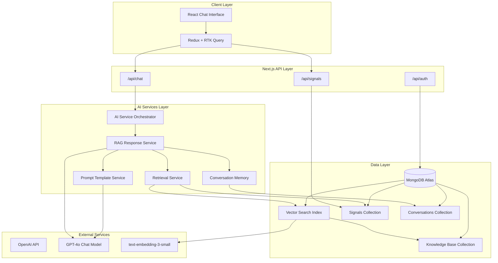

---

## RAG Pipeline Flow

The RAG system combines real-time trading signals with expert knowledge to generate contextual responses.

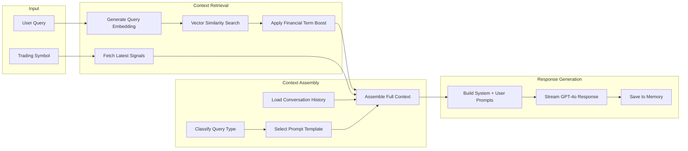

---

## Database Architecture

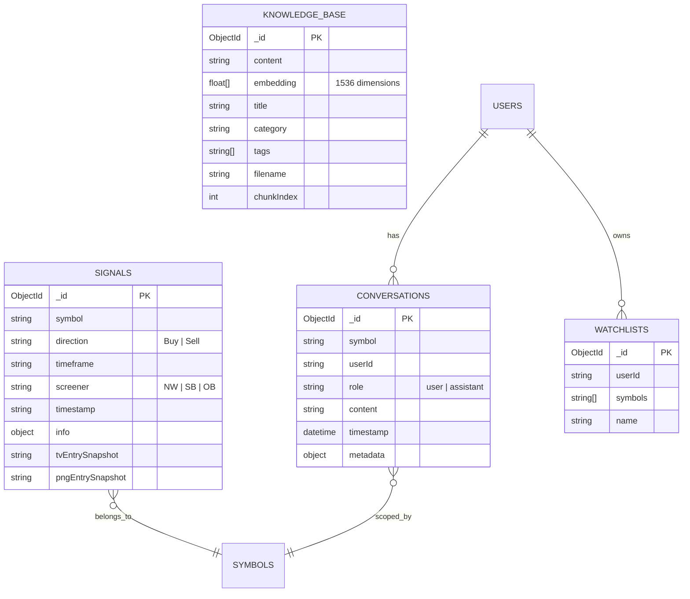

---

## Signal Type System

Stock Buddy processes three types of Smart Money Concept (SMC) trading signals:

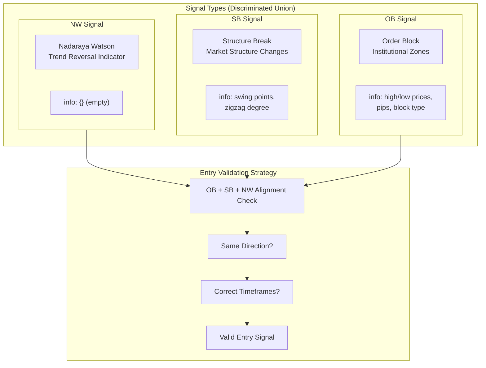

---

## Knowledge Base Structure

The AI is augmented with expert trading knowledge stored as vector embeddings:

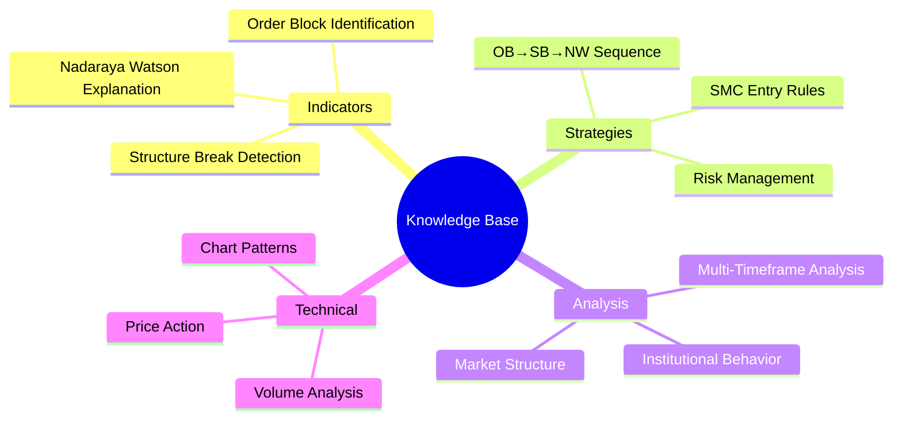

### Knowledge Retrieval Process

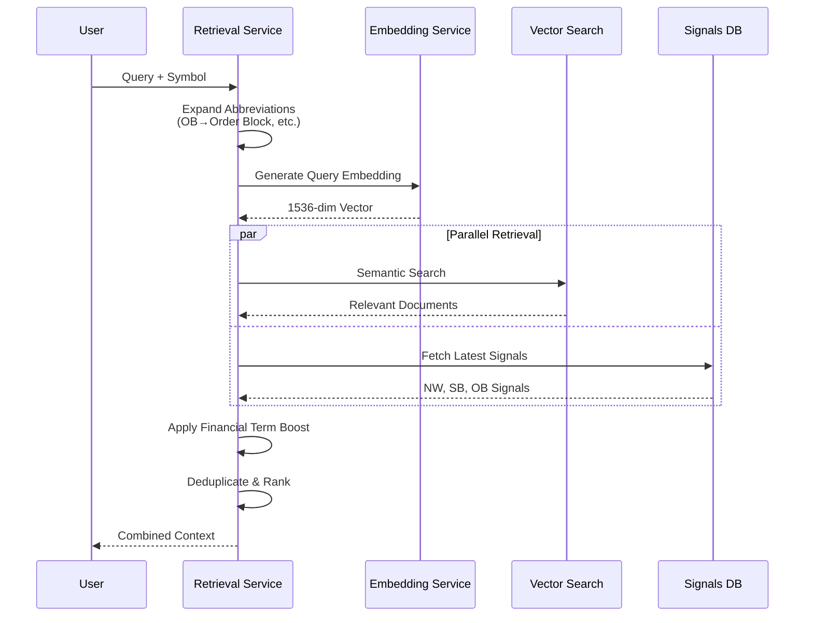

---

## Conversation Memory Architecture

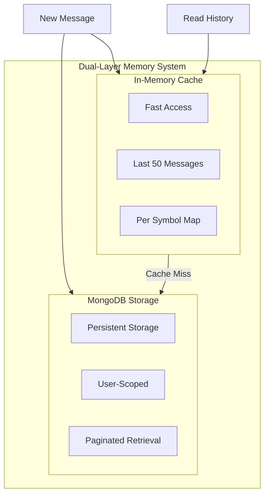

---

## Key Features

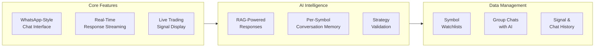

### Feature Summary

| Feature | Description |
|---------|-------------|
| **RAG Chat** | AI responses augmented with trading knowledge and real-time signals |
| **Signal Integration** | NW, SB, OB signals displayed inline with chat |
| **Strategy Validation** | Automatic OB→SB→NW sequence and direction alignment checks |
| **Conversation Memory** | Per-symbol chat history with user scoping |
| **Streaming Responses** | Real-time token-by-token response display |
| **Watchlist Management** | Organize and track multiple trading symbols |
| **Group Chat** | Collaborative trading discussions with AI assistance |
| **Signal Attachments** | Attach signals to messages for context |

---

## Technology Stack

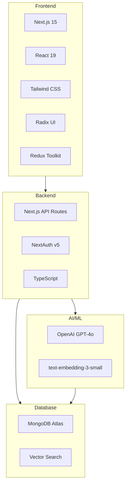

---

## Request-Response Flow

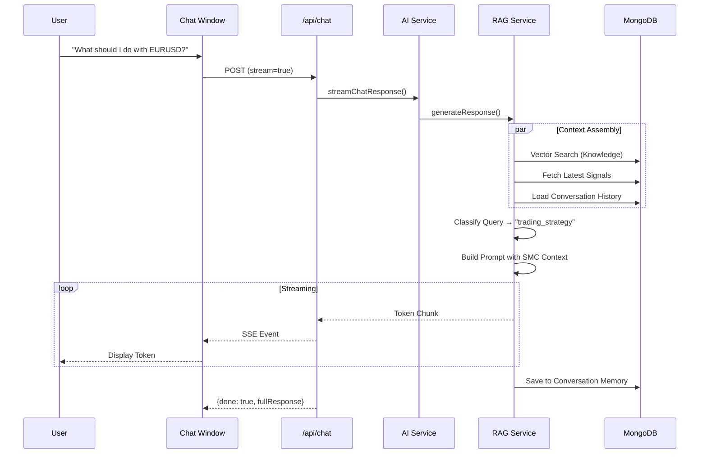

---

## Security & Scoping

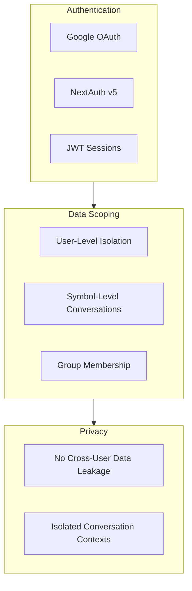

---

## Performance Optimizations

| Layer | Optimization | TTL/Limit |
|-------|-------------|-----------|
| **Response Cache** | Identical query caching | 15 minutes |
| **Retrieval Cache** | Knowledge search results | 10 minutes |
| **Embedding Cache** | Vector embeddings | FIFO @ 100 items |
| **Signal Cache** | RTK Query auto-cache | 5 minutes |
| **Memory Cache** | In-memory conversations | 50 messages/symbol |

---

## Summary

Stock Buddy implements a production-grade RAG architecture that:

1. **Retrieves** relevant context via MongoDB Vector Search
2. **Augments** queries with SMC trading knowledge and live signals
3. **Generates** responses using GPT-4o with specialized prompts
4. **Remembers** conversations per user and trading symbol
5. **Validates** trading strategies through signal sequence analysis
6. **Streams** responses for optimal user experience
